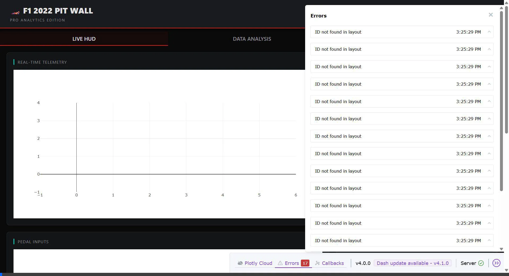

# 🏎️ F1 2022 Pit Wall Pro — v7.0 Simulation Master

[](https://www.python.org/)
[](LICENSE)
[](shared_state.py)
[](core/physics_engine.py)

**F1 2022 Pit Wall Pro** is an industry-leading, high-performance telemetry and race engineering suite. Re-engineered for zero-latency in-memory processing, it transforms raw UDP data from the F1 2022 game into professional-grade engineering insights, 3D visualizations, and AI-driven coaching.

---

## 📸 Dashboard Preview



---

## 💎 Elite Features

| Category | Features |
|---|---|
| 📐 **Simulation Master** | **3D Track Replay** with elevation (PosY), **Dirty Air Aero Analysis** (real-time downforce loss estimation). |
| 🎓 **AI Coaching** | **AI Braking Coach** (live audio feedback), **ML Tyre Degradation** prediction (RandomForest model). |
| 🌐 **Cloud & Social** | **Multiplayer Live Stream** (Ngrok tunneling), **Discord Integration** (Auto-post best laps & PDF reports). |
| 📊 **Pro Analysis** | **MoTeC i2 Pro Export**, Multi-lap overlay comparison, Sector-by-sector delta tracking. |
| 🖥️ **Desktop GUI** | Native Windows application window, Dark-themed premium CSS, In-Memory 0ms latency core. |
| 📡 **Race Engineer** | **Live Voice Alerts** (Fuel, Tyres, ERS, Damage, Safety Car, Coaching) via TTS. |
| 🌦️ **Strategy** | **Rain Radar** (30-min forecast), Interactive Pit Stop Strategy Planner & Simulator. |

---

## 🏗️ Project Architecture

```
udp_telemetry/
├── app.py                  # MAIN ENTRY — Native Desktop GUI + Ngrok + UDP Coordinator
├── shared_state.py         # MEMORY POOL — Thread-safe, zero-latency RAM storage
│
├── core/                   # Logic Layer
│   ├── listener.py         # Binary packet unpacking (Motion, Telemetry, Lap, Session)
│   ├── physics_engine.py   # Aero Analyzer (Dirty Air), Tyre Thermals, Fuel Deficit
│   └── ml_engine.py        # Braking Coach logic, Tyre Cliff prediction, K-Means Clustering
│
├── ui/                     # Presentation Layer
│   ├── layout.py           # Dashboard structure (Live HUD, Analysis, Strategy tabs)
│   └── callbacks.py        # Reactive live updates and interactive plotting logic
│
├── services/               # Infrastructure
│   ├── exporter.py         # MoTeC CSV Engine, PDF Reporter, Discord Webhook Service
│   └── data_service.py     # SQLite persistence for lap times and telemetry history
│
├── plotting/               # Visualization builders (Plotly 2D/3D charts)
└── assets/                 # Custom CSS Design System and UI assets
```

---

## 🚀 Installation & Setup

### 1. Clone & Install Dependencies
```bash
git clone https://github.com/UmutSemihSoyer/f1-telemetry-dashboard.git
cd f1-telemetry-dashboard
pip install -r requirements.txt
```

### 2. Configure Integrations
Edit `config.json` to personalize your experience:
- **Discord:** Add your `DISCORD_WEBHOOK_URL` for auto-reporting.
- **Remote Engineering:** Set `STREAMING_ENABLED: true` and add your `NGROK_AUTH_TOKEN` to share your dashboard live.

### 3. Start the Suite
```bash
python app.py
```
*Wait for the "🚀 REMOTE STREAM ACTIVE" log if using Ngrok, then share the generated URL with your engineer.*

---

## 🕹️ In-Game Configuration (F1 2022)

To connect the suite to your game:
1. Go to **Settings > Telemetry Settings**.
2. Set **UDP Telemetry** to `On`.
3. Set **IP Address** to `127.0.0.1`.
4. Set **Port** to `20777`.
5. Set **UDP Format** to `2022`.
6. Set **UDP Rate** to `20Hz` or `60Hz` (recommended).

---

## 🧪 Advanced Modules

### 🎓 AI Braking Coach
The coach monitors your braking points against your **Personal Best** lap stored in memory. It provides instantaneous audio feedback:
- *"Brake later!"* (If you braked 8m+ earlier than your PB)
- *"Braked too late!"* (If you overshot the entry)

### 📐 3D elevation Analysis
The **Analysis** tab features a 3D topographic map of the track. By capturing `PosY` coordinates from the Motion UDP packets, the suite renders the track's vertical profile, allowing you to analyze your racing line through elevation changes (e.g., Raidillon at Spa).

### 🌪️ Aero & Dirty Air
The **Aero Analyzer** estimates downforce loss when following a car within 0.7s. It compares your current lateral G-forces against clean-air baselines to calculate the "Dirty Air" penalty in real-time.

---

## 📦 Core Dependencies

- `dash`, `plotly` (Visualization)
- `pywebview` (Native Windowing)
- `pyngrok` (Remote Tunneling)
- `scikit-learn` (Tyre & Braking ML)
- `fpdf2` (PDF Reporting)
- `pyttsx3` (Voice Engineer)
- `pandas`, `numpy` (High-speed data processing)

---

## 📄 License
MIT License — © 2026 Umut Semih Soyer
